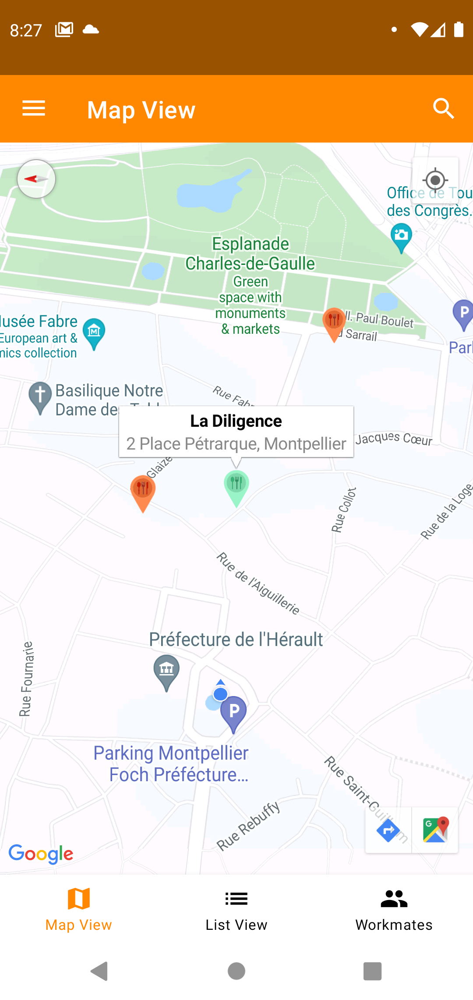
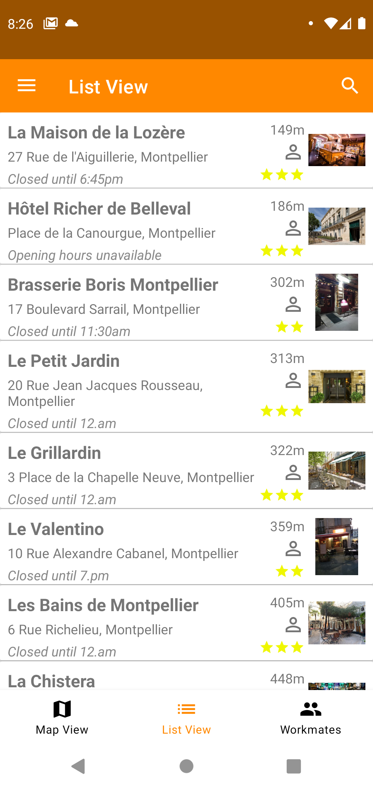
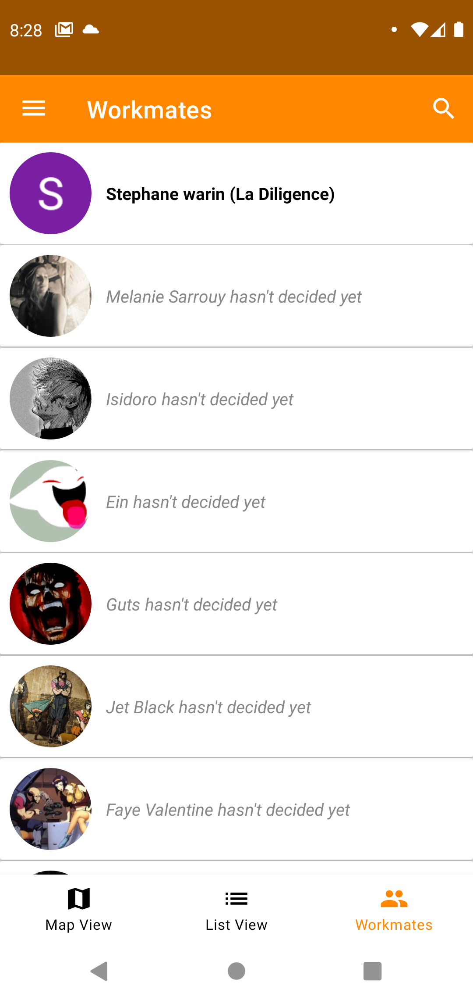

 	

# GO4LUNCH, Java version
Android application to find restaurants near you. Allow you to choose one for the next lunch and share your selection with your coworkers.
You'll also be able to check out where your coworkers are headed for lunch and decide if you want to go with them.
Be notified by a push notification before the lunch break: this will inform you of the address and the employees who will be at the same place.

 	

## Features
* Authentification with Gmail and Facebook via Firebase Authentification
* Main activity:
	* Navigation Drawer (access to your lunch of the day, settings for the notification and logout)
	* SearchView with autocomplete from GoogleMap API

 	

* 3 fragments:
	* the listView, which displays a list of 20 restaurants with full opening hours
	* the mapView, which displays a GoogleMap with your position and the restaurant list
	* the workmatesView, which displays the coworkers list and if they have chosen a restaurant

 	
&nbsp; &nbsp; &nbsp; &nbsp;
 	
&nbsp; &nbsp; &nbsp; &nbsp;
 	

* A restaurant details activity that allows you to call the restaurant, visit website, add to favorite, select this place for today and see coworkers with the same choice
* A chat activity that can be launched from the workmatesView
* Every day, the database will create a collection with the actual date to store the user's choice
* The notification push is managed with a WorkManager, and will display the notification just before lunch break

## Library
* Material Design:
	* constraint layout
	* coordinator layout
	* collapsing toolbar
* Glide
* Firebase Auth
* Firebase Firestore
* Facebook SDK
* Retrofit
* WorkManager
* Mockito
* Desugar

## Architecture
* MVVM with an approach of clean Architecture (viewModel, ViewState, Usecase, Repository)
* LiveData

## Dependency injection
* ViewModel factory, handmade

## Unit tests
* ViewModel and usecase with Mockito

## API
* Google Map API:
	* place nearby search
	* place details
	* place autocomplete
